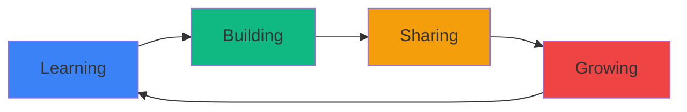

<div align="center">

#  Hi there, I'm Kelvin Mwarano👋


[](https://github.com/MwaranoKelvin)
[](https://github.com/MwaranoKelvin)

</div>

---

## 🚀 About Me

```typescript
const kelvin = {
    location: "Nyeri, Kenya 🇰🇪",
    currentFocus: "Building innovative solutions",
    interests: ["Web Development", "Data Structure and Algorithm", "Computer Networks", "Open Source"],
    funFact: "I debug with console.log() and I'm not ashamed! 😄"
};
```

- 🔭 Currently working on exciting projects
- 🌱 Always learning and exploring new technologies
- 💡 Open to collaborating on innovative ideas
- 📫 Let's connect and build something amazing together!

---

## Tech Stack

<div align="center">

### Languages


### Frameworks & Libraries


### Tools & Platforms


### Databases


</div>

---

## GitHub Stats

<div align="center">
  


</div>

<div align="center">
  
[](https://git.io/streak-stats)

</div>

---

## Contributions

<div align="center">


<br/>
  


</div>

---

## Activity Graph

<div align="center">

[](https://github.com/ashutosh00710/github-readme-activity-graph)

</div>

---

## Top Projects

<div align="center">

[](https://github.com/MwaranoKelvin/Final-Project)
[](https://github.com/MwaranoKelvin/PLP-Personal-Profile-Hackathon)

</div>

---

##  Connect With Me

<div align="center">

[](www.linkedin.com/in/kelvinmwarano)
[](https://x.com/MwaranoKE?s=20)
[](mailto:kelvinmwarano4@gmail.com)
[](https://kelvinmwarano.vercel.app/)

</div>

---

## 💡 Dev Quote

<div align="center">


</div>

---

## 🎯 Current Focus



---

<div align="center">

### 🌟 Show some ❤️ by starring some of my repositories! 🌟


**"Code is like humor. When you have to explain it, it's bad." – Cory House**

</div>

---

<div align="center">
  
### Open for collaboration and opportunities!

*Let's build something amazing together* 

</div>
